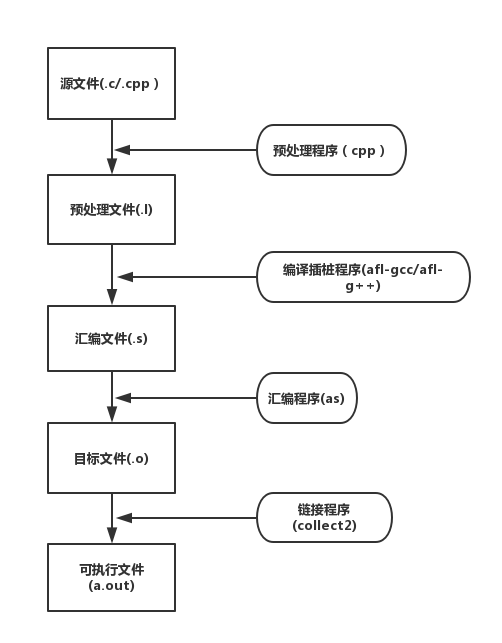

## 原理

AFL采用代码插桩的方法，对遗传算法进行指导，提高代码覆盖率。具体说来，插桩代码把当前地址放到一个全局变量中，类似一个hashmap的地图，设置遗传算法，能够产生不同路径的地图优先度高。

对中afl-gcc编译的crash可执行文件的反汇编，可以看到有一些__afl_maybe_log插桩代码。

## AFL工作流程

Fuzz流程：

    1.读取输入的初始testcase, 将其放入到queue中；
    2.从queue中读取内容作为程序输入；
    3.尝试在不影响流程的情况下精简输入；
    4.对输入进行自动突变；
    5.如果突变后的输入能够有新的状态转移，将修改后的输入放入queue中；
    6.回到2。

## 对代码进行插桩

在使用AFL 编译工具 afl-gcc对源码进行编译时，程序会使用afl-as工具对编译并未汇编的c/c++代码进行插桩。过程如下：

	1.afl-as.h定义了被插入代码中的汇编代码；
	2.afl-as逐步分析.s文件(汇编代码)，检测代码特征并插入桩。

过程如下图所示：

过程描述：
	
	1.编译预处理程序对源文件进行预处理，生成预处理文件(.i文件)
	2.编译插桩程序对.i文件进行编译，生成汇编文件(.s文件)，afl同时完成插桩
	3.汇编程序(as)对.s文件进行汇编，生成目标文件(.o文件)
	4.链接程序(ld)对.o文件进行连接，生成可执行文件(.out/.elf文件)

当然llvm/clang插桩方式是另外的一套机制，通过修改LLVM IR(中间语言)实现。

## AFL编译程序
    
    $ CC=/path/to/afl/afl-gcc ./configure
    $ make clean all C++ 程序, 设置 CXX=/path/to/afl/afl-g++.

AFL编译链接可执行文件和库文件时，建议使用static link(静态链接库，libxxx.a文件)，当使用动态链接库时，将动态链接库（如当前目录）加到环境变量中：export LD_LIBRARY_PATH=$LD_LIBRARY_PATH:.

## 选择初始化用例

	1.保证文件足够小，fuzzing测试速度不至于太慢；
	2.选取不同的testcase时，选取不同类型的testcase。
	3.使用afl-cmin精简testcase

如果测试用例导致afl-fuzz速度慢，可以使用LLVM-based mode(compile with clang)，可以提速两倍，或者使用 -d option

## Fuzzing Binaries

	./afl-fuzz -i testcase_dir -o findings_dir /path/to/program @@

	-m 设置内存限制,当不限内存时，set -m none
	-f xxx 当一个程序读取文件名固定时，set -f xxx(xxx为文件名)
	-t 当fuzzing的程序数据交互时间较长，set -t xxx(xxx为超时时间)

## 输出目录说明
	
	queue/ - 每个独特执行路径的测试用例，以及用户给出的所有起始文件。这是第2节中提到的合成语料库。在将此语料库用于任何其他用途之前，
	可以使用afl-cmin工具将其缩小为较小的大小。该工具将找到提供等效边缘覆盖率的较小文件子集。
	
	crashes / - 导致测试程序收到致命信号的独特测试用例（例如，SIGSEGV，SIGILL，SIGABRT）。条目按接收到的信号分组。
	
	hangs/ - 导致测试程序超时的唯一测试用例。在东西被分类为挂起之前的默认时间限制是1秒和-t参数的值中较大的一个。该值可以通过设置AFL_HANG_TMOUT
	进行微调，但这很少需要。

在crash文件夹，找到令程序崩溃的输入。

	如果需要重新开始AFL Fuzzing时，删除output文件夹，或者指定另外的输出文件夹
	如果需要继续已经停止的AFL Fuzzing测试，使用 afl-fuzz -i-(如：./afl-fuzz -i- -o findings_dir /path/to/program @@)来继续Fuzzing。

## 并行Fuzzing测试

每个afl-fuzz进程占据CPU的一个核，也就是说如果是多核的主机，AFL就可以并行工作，并行模式也为AFL与其他Fuzzing工具、符号执行引擎(symbolic or concolic execution engines)交互提供了便利。

## 验证Crash

如果程序Fuzzing过程发生crash，那么会在afl/output/crash文件夹下记录引发crash的输入文件，使用gdb单步调试可以定位引发崩溃的代码位置。但是有些比较复杂的程序利用gdb可能比较难定位问题，使用-C option。

## LLVM Mode

LLVM Mode(afl-clang)模式编译程序Fuzzing速度是afl-gcc模式的2倍，但是使用此模式必须先安装llvm套件,参见learning LLVM project — clang，配置LLVM_CONFIG(export LLVM_CONFIG=`which llvm-config`),然后在afl/llvm_mode/文件夹下执行make，会在afl/目录下生成afl-clang-fast/afl-clang-fast++。 使用afl-clang-fast编译C程序：

	$CC=/path/to/afl/afl-clang-fast ./configure [...options...]
	$make

最后还是会调用clang/clang++来编译程序，在编译程序时会检查编译选项(makefile中的CFLAGS)，clang提供很多内存检查的工具如ASAN/MSAN/UBSAN等，以及afl编译选项AFL_QUIET(Qemu模式)，这些选项可以直接填写进makefile的编译选项也可以设置到环境变量中，afl-gcc/afl-clang在开始编译前会检查这些环境变量。

环境变量设置详情见：env_variables.txt

## ASAN结合使用

ASAN/MSAN/UBSAN原本输入clang编译器选项，后来在高版本的gcc中集成。在发现内存问题中ASAN/MSAN/UBSAN发挥着重要的作用。有大牛表示：“AFL Fuzzing without ASAN is just a waste of CPU”。

使用ASAN方法：

    set AFL_USE_ASAN=1 before calling ‘make clean all’
    add -fsanitize=address option into makefile

使用ASAN编译选项尽量编译成32位系统程序(-m32), 因为Address Sanitize使用Shadow Memory机制，在32机器上需要大约800M的内存，但是在x86_64系统上需要大约20TB的内存。

## Qemu Mode

在无源码的情况下Fuzzing二进制文件，详细请参见afl/qemu_mode/README.qemu

## 总结

AFL许多技术细节很有意思，设计思想也很巧妙，灵活使用必定能发现很多漏洞。本文多次提到ASAN/MSAN等工具，后续将更加详细讲解AFL+ASAN结合使用，此乃当前白盒测试领域的神器。

## persistent mode

The LLVM mode also offers a “persistent”, in-process fuzzing mode that can work well for certain types of self-contained libraries, and for fast targets, can offer performance gains up to 5-10x; and a “deferred fork server” mode that can offer huge benefits for programs with high startup overhead. Both modes require you to edit the source code of the fuzzed program, but the changes often amount to just strategically placing a single line or two.

## 持久化模式

Some libraries provide APIs that are stateless, or whose state can be reset in between processing different input files. When such a reset is performed, a single long-lived process can be reused to try out multiple test cases, eliminating the need for repeated fork() calls and the associated OS overhead.

The basic structure of the program that does this would be:
	
	  while (__AFL_LOOP(1000)) {
	
	    /* Read input data. */
	    /* Call library code to be fuzzed. */
	    /* Reset state. */
	
	  }
	
	  /* Exit normally */

The numerical value specified within the loop controls the maximum number of iterations before AFL will restart the process from scratch. This minimizes the impact of memory leaks and similar glitches; 1000 is a good starting point, and going much higher increases the likelihood of hiccups without giving you any real performance benefits.