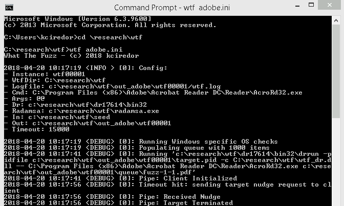

> 译文声明
> 本文是翻译文章，文章原作者kciredor，文章来源：https://kciredor.com/ 
> 
> 原文地址：https://kciredor.com/fuzzing-adobe-reader-for-exploitable-vulns-fun-not-profit.html
> 
> 译文仅供参考，具体内容表达以及含义原文为准

# fuzz Adobe Reader寻找可利用的vulns（乐趣！=赢利）

## Bin vs Web

自从我上一篇博客报道网站API中的IDOR以来，已经过去了半年。是时候写一些新的有趣的东西！当我的注意力从网站转移到二进制后，一个新的世界向我敞开了大门。

我转变的原因是我对逆向工程的热爱。通过反汇编进行阅读，跟随代码一起在调试器中执行。我对逆向工程一直满怀热情，二进制漏洞利用恰好满足。在@ corelanc0d3r的Exploit Development Bootcamp期间，我完全迷上了，之后我要求自己向更高级进发。

## Adobe Reader

第一步是找到你的第一个目标。我选择Adobe Reader的主要原因是因为它是一个众所周知的应用程序。另外，我认为在PDF阅读器中查找错误比在Chrome浏览器中更容易。据我所知，Adobe Reader，Office和众所周知的互联网浏览器是发现可利用漏洞的前5大知名同时也是最难的应用程序。这很有趣。

## 先fuzz，再利用

哇，我这里低估了fuzz！我一直告诉自己，一旦发现Adobe Reader中的错误，需要相当长的时间来构建可靠的漏洞利用。一旦有可利用的崩溃，有太多的缓解措施需要解决。其中包括：数据执行保护（DEP），地址空间布局随机化（ASLR），沙盒（限制了你的代码可以做什么）。很难去绕过这些措施去执行任意代码。

但在开始构建漏洞利用之前，您需要触发一个或多个错误的漏洞。也许一个是可以泄漏DLL地址以绕过ASLR的漏洞，又或许是一个覆盖异常处理程序地址并触发崩溃的漏洞。那么你如何找到这些漏洞？答案是fuzz。而如果Adobe Reader没有这样的漏洞，也就不用考虑漏洞利用了。

我花了几个月在fuzz上。

深入fuzz你会发现它是一个独立的世界。有许多概念和工具。以及无尽的可能性，试图迫使目标崩溃。基本思想是尽可能多地生成输入（例如输入文件），然后尽可能快地对目标进行运行。如果幸运的话，一个或多个输入会使目标崩溃。

不能一味的依赖运气，需要提供比随机输入更好的想法。

## 条条大路通罗马

模糊Adobe Reader这样复杂的目标需要你真正了解目标。在反汇编器中打开一些可执行文件/ DLL，看看你可以组成符号（如果有）和引用。也许你会发现Adobe Reader使用libtiff，它可以帮助我们了解可能的方法。

现在让我们看看我们如何攻击我们的目标。

# 利用开源PDF阅读器生成语料库

研究员@ yrp604向我解释说，很难获得像Adobe Reader这样的目标的覆盖，主要是因为它很慢且很难编排。他的建议是在开源PDF阅读器上创建足够大的PDF语料库，并将该语料库放在Adobe Reader上。所以我照做了。

最流行的fuzzers中有@lcamt​​uf的American Fuzzy Lop（afl-fuzz）。通过覆盖目标应用程序的代码路径，afl实际上学习了输入文件格式的外观，而不仅仅是将随机输入文件放在目标上。此外，它还利用Linux分叉对每个处理器内核每秒执行数百次甚至数千次目标执行。

为了在Linux上fuzz开源阅读器，你应该为自己找几个vm，并附上你喜欢的发行版。安装afl并下载开源阅读器tarball。现在将它解压到/ dev / shm中，这是共享内存。我们尝试静态编译所有内容并运行内存中的所有内容，以便每秒获得更多执行次数。此外，您需要使用afl的编译器之一来编译开源阅读器。此外，我们应该处理任何输出文件写入使得速度更快。

我同时为3个不同的目标设置了fuzzing：xpdf，mupdf和ghostscript。让我与你分享一个关于xpdf的例子。

	-将xpdf v4.x源代码解压到/ dev / shm中，以便我们在RAM中工作。
	-您的目标需要接受输入文件，并且应该完全解析输入的PDF。我选择了pdftoppm.c。
	-编辑pdftoppm.c并修补输出文件写入。我简单地在for循环之前放置了一个continue，直到写入行开始：if（！strcmp（ppmRoot，“ - ”））。
	-使用afl的gcc或clang编译xpdf，对于我来说，clang最终更快地运行xpdf。强化它并使用Address Sanitizer找到更多有趣的输入：

	mkdir build && cd build && CC=afl-clang-fast CXX=afl-clang-fast++ cmake -DCMAKE_BUILD_TYPE=Release .. && USE_ASAN=1 AFL_HARDEN=1 make

	-将你的输入文件放在/ dev / shm / in-raw中。你应该从一个很好的输入语料库开始，例如，从https://github.com/mozilla/pdf.js/tree/master/test/pdfs获取一些文件
	-您需要提供唯一的输入，没有理由提供相同代码路径的模糊输入。我们通过最小化我们的输入语料库来做到这一点：

	afl-cmin -i in-raw -o in -- xpdf-4.00/build/xpdf/pdftoppm -mono -r 1 @@ -

	-现在你也可以使用afl-tmin最小化每个文件，你应该这样做：

	find in/ -type f -size +10k -delete

	-现在从屏幕或tmux中运行您的模糊器，并运行尽可能多的模糊器，因为您有内核可用！您可以使用afl-gotcpu验证您是否在正确的轨道上。

	afl-fuzz -i in -o out -x /usr/share/afl/dictionaries/pdf.dict -M master -- xpdf-4.00/build/xpdf/pdftoppm -mono -r 1 @@ -
	
	-注意我在pdftoppm中使用的命令行：-mono -r 1确实可以加快速度。此外，我使用afl提供的词典帮助afl更快地学习PDF格式。@@将被afl替换为生成的输入。用每个核心的-S slave1，-S slave2等替换-M master。
	-不要忘记设置一个将你的语料库从/ dev / shm备份到永久存储的cronjob。一个简单的崩溃会让你重新开始！
	-注意：您可能能够利用afl的持久模式，通过循环实际的渲染功能可以使模糊更快。看看它，文档非常好。

在6核Xeon虚拟机上，我能够在xpdf上获得每秒1200次执行，在mupdf上获得4000次执行，在ghostscript上获得20次（lol）。你可以使用afl-whatsup得到一个很好的总结视图。

# 在Adobe Reader上投放开源PDF语料库

运行这3个模糊器大约6周，为我提供了一个500k pdf文件的语料库。现在我们需要关注一些事情，然后才能进行适当的测试。首先，你将有3个服务器中/ dev / shm / out /下的子目录queue, crashes, hangs。将out目录复制到本地机器或vm中，并使用一些Unix foo将它们一起加入到具有唯一文件名的单个目录中。像这样的应该做的诀窍：

	find . -type f -name 'id*' -size +0 | gawk 'BEGIN{ a=1 }{ printf "cp \"%s\" ../%08d.pdf\n", $0, a++ }' | bash

现在创建一个Windows批处理文件，它将遍历所有文件并启动Adobe Reader，例如：

	for %%f in (y:\*.pdf) do AcroRd32 %%f

你可以从你的Windows虚拟机运行这个。您还需要使用AutoIt代码弹出式杀手脚本，这将关闭像“This PDF is corrupted”这样的弹出窗口。由于您无法为此设置添加超时，因此您必须每隔一段时间手动关闭“阅读器”窗口......

我们该如何改进？只需使用@berendjanwever的BugId即可。它会为你输出html报告，你可以添加超时。批处理文件现在看起来像这样，你就全都设置好了：

	for %%f in (y:\*.pdf) do bugid acrobatdc --nApplicationMaxRunTime=15 -- "%%f"

请注意，BugId会建议为您的目标启用整页堆叠，并且您应该在fuzz目标时进行。它会提供给你设置它。你也可以使用gflags来达到这个目的。启用pageheap将使您发现更多的错误。不要忘记在构建您的漏洞利用时再次禁用它。

我再次建议您将所有东西部署在云虚拟机上，以便在后台运行时关闭笔记本电脑屏幕。当你在它的时候，为什么不为FoxitReader同时运行完全相同的设置？

对于我来说，这个500k的语料库对Adobe Reader没有太大的帮助（因为没有任何崩溃，有几个挂起）。尽管它确实让FoxitReader崩溃，但这些崩溃通常被认为不可被利用。错误不一定是漏洞。

#（Win)AFL模糊Adobe Reader本身

开源PDF语料不包含触发Adobe Reader或FoxitReader中的漏洞的任何输入。

在Adobe Reader上使用afl不是很酷吗？它可能会很慢，但碰撞会导致我们的最终目标真正崩溃。Adobe Reader在Windows和MacOS上运行。我是Linux用户，所以我开始使用安装了Adobe Reader DC的本地Windows 8虚拟机。没有必要安装Windows 10我想，因为这可能会使事情变得更复杂，事前进行更多的缓解。您现在知道afl不支持Windows开箱即用，但@ifsecure实际上是通过利用DynamoRIO移植并发布了WinAFL。

WinAFL将要求您指定一个函数名称（给定目标具有符号）或函数偏移量，您应该通过逆向工程来找到目标应用程序。该功能应该打开你的输入，处理它，关闭你的输入。WinAFL将运行你的目标应用程序，并且一次又一次地循环这个函数，每次恢复内存状态就好像它是第一次运行一样，同时替换输入文件。这是每秒执行大量执行的一个聪明方法。

所以我首先尝试了一个简单的目标WinAFL：unrar.exe，一个小的CLI应用程序。这似乎很好。在反汇编器中加载unrar.exe并找到你的偏移量和参数数量。填充一个小输入语料库并运行WinAFL。例如：

    c:\research\winafl\bin64\afl-fuzz.exe -t 1000+ -i c:\research\unrar\in -o c:\research\unrar\out -D C:\research\dr\bin64 -- -fuzz_iterations 5000 -target_module unrar.exe -nargs 3 -target_offset 0xE864 -coverage_module unrar.exe -- unrar.exe p @@

对于Adobe Reader和FoxitReader等更复杂的应用程序，我无法轻松完成这些任务。

## 尝试1：Harness AcroRd32.dll

当您反汇编Adobe Reader（我专注于AcroRd32.dll）时，您会发现一些对PDDoc的引用。这让我想到：编写一个在AcroRd32.dll上执行LoadLibrary并使用GetProcAddress调用打开和处理PDF文档的方法的demo怎么样。

这没有奏效：args的数量与我在几个在线Adobe SDK资源中找到的args数量不匹配。此外，我很难弄清楚所有需要实施的疯狂数据结构。

反复试验导致错误。我的harness.cpp现在在垃圾箱中。

## 尝试2：使用JP2KLib.dll

这个dll负责渲染JPEG2000文件，那么如果我们只关注PDF处理的那部分呢？那么，我又一次尝试找出JP2KLib.dll的工作方式。使用API​​调用间谍软件也没有帮助（没有符号，只是巨大的结构）。

下一个！

## 尝试3：找到WinAFL的偏移量来定位真实的东西

我花了相当多的时间和精力在AcroRd32.exe和.dll中查找模糊功能。

但即使你能找到满足WinAFL这种方法要求的方法，但在你试图用WinAFL进行模糊化时，你会发现它不能涵盖在子进程中运行的代码。Adobe Reader产生了一个完成繁重工作的子进程。

您可以通过在WinDbg中加载Reader并在初始中断时应用.childdbg来确认这一点。在随后的休息时间，您可以检出加载的模块，在进程之间切换等。

不确定即使child的覆盖范围是可能的，你也可以为WinAFL提供适当的目标函数。它需要打开输入，渲染并立即关闭以释放资源，以便WinAFL可以重新输入新的输入。我不认为这样的功能是内置在Adobe Reader中的:-)也许......编写一个自定义插件？然后让模糊器覆盖AcroRd32.dll，但定位您的插件功能。我没有进一步调查这条道路。

# 利用PDF库

浏览Adobe和Foxit的网站，您会发现实际上有可供下载和使用的SDK。这给了我一个想法，你可以编写自己的demo，它只需使用SDK公开的引擎在内存中呈现给定的输入PDF。可能性是这与实际的Reader用于渲染的引擎完全相同。

首先，您需要获得Adobe和/或Foxit SDK的副本。请注意，这些SDK可用作评估软件包。

以下是我制作并用于模糊渲染引擎的Adobe PDFL线束的C ++代码：

	/ ***************************************************************************************************
	//
	// Harness.cpp leverages the Adobe PDFL libs to render (in-mem) every page of a given pdf.
	// Features a public fuzz method which can be used as target method in WinAFL
	//
	// Based on the open source RenderPage DataLogic PDFL example from github:
	// https://github.com/datalogics/adobe-pdf-library-samples/tree/master/CPlusPlus/Sample_Source/
	//
	// Confirm render timing: powershell -Command "Measure-Command {./harness.exe test.pdf | Out-Default}"
	//
	// (c) kciredor 2018
	//
	// ***************************************************************************************************
	
	#include "APDFLDoc.h"
	#include "InitializeLibrary.h"
	
	#include "RenderPage.h"
	
	#define RESOLUTION  110.0
	#define COLORSPACE  "DeviceRGB"
	#define FILTER      "DCTDecode"
	#define BPC         8
	
	extern "C" __declspec(dllexport) void fuzz(char* fn);
	
	APDFLib libInit;
	
	void fuzz(char* fn) {
	    std::cout << "Rendering " << fn << " - Res " << RESOLUTION << ", Colorspace " << COLORSPACE << ", Filter " << FILTER << ", BPC " << BPC << std::endl;
	
	    DURING
	        APDFLDoc pdfDoc(fn, true);
	    
	        for (int i = 0; i < pdfDoc.numPages(); i++) {
	            PDPage pdPage = pdfDoc.getPage(i);
	            RenderPage drawPage(pdPage, COLORSPACE, FILTER, BPC, RESOLUTION);
	
	            PDPageRelease(pdPage);
	        }
	
	        PDDocRelease(pdfDoc.getPDDoc());
	    HANDLER
	        std::cout << "Catched PDFL error" << std::endl;
	    END_HANDLER
	}
	
	int main(int argc, char** argv) {
	    if (! libInit.isValid()) {
	        std::cout << "PDFL init failed with code " << libInit.getInitError() << std::endl;
	
	        return false;
	    }
	
	    if (argc != 2) {
	        std::cout << "Requires input.pdf parameter" << std::endl;
	
	        return false;
	    }
	
	    fuzz(argv[1]);
	
	    return true;
	}

现在编译它，把它放在PDFL DLL的旁边，填充一个小的种子语料库（尝试'small.pdf'）并开始模糊：

	c:\research\winafl\bin32\afl-fuzz.exe -t 10000+ -x c:\research\winafl\testcases\extras\pdf.dict -i c:\research\reader\in -o c:\research\reader\out -D C:\research\dr\bin32 ^
	-- -fuzz_iterations 5000 -target_module harness.exe -nargs 1 -target_method fuzz -covtype edge ^
	-coverage_module DL150PDFL.dll ^
	-- harness.exe @@

把这个设置放在一个云虚拟机上，让它运行一段时间。根据真实的Acrobat Reader对日常发现的崩溃进行分类。不幸的是，对我来说，这条路没有按照我的预期工作：PDFL崩溃！=实际的Reader崩溃。

你可以为福昕做同样的事情。实际上在这里遇到了一些真正的FoxitReader崩溃，但不能再次被利用。编码这个demo是一样容易，你可以自己编写，这会有一些乐趣。

# 更好地理解PDF文件格式：libtiff

就像我之前提到的那样，当你反汇编主要的可执行文件或主dll时，你可能会发现Adobe Reader使用libtiff。与libpng相同的东西。因此，另一个想法是模糊libtiff并将崩溃的tiff包装成PDF。您可以在Linux上使用afl来模糊libtiff，并获得一些很好的速度（6个Xeon内核上的12000 /秒），这次我也应用了afl的持久模式。

如果您想在PDF中包装TIFF而不更改tiff一点，则可以将其作为带有base64嵌入式图像内容的ImageField放入XFA中。XFA是将表单嵌入到PDF中的两种方法之一。您希望自动执行此过程，但您可以使用Adobe AEM Forms Designer以一个干净的PDF格式开始。现在它已被认为是旧的并免费发布（在adobe.com上的序列号），但下载链接很难找到。

因此，在模糊libtiff几天后，自动将所有崩溃事件包装到XFA中并转换为PDF格式，并对结果PDF进行分类后，我没有得到任何有价值的崩溃。另一方面，一些PDF的确会设法使Adobe Reader 9.3崩溃，甚至可以被利用！但那是旧的东西，我瞄准了最新的DC版本。它似乎使Adobe更加强化libtiff，它不仅仅是他们使用的最新开源版本的副本。

# 编码我自己的自定义模糊器

我记得Corelan暗示你必须编写自己的模糊器，否则每个人都会发现相同的错误。模糊的艺术（在这篇文章结尾的PDF链接）表明了相同。

好吧。我们开始做吧。:-)

你如何开始编码你自己的模糊器？我会说有一定的基本要求：

	-运行目标应用程序
	-为目标输入您的输入
	-处理超时
	-赶上崩溃
	-模糊输入

我通过阅读WinAFL和afl源代码开始了解它是如何工作的。很快，我决定在C中编写fuzzer和DynamoRIO客户端，并使用客户端获取代码覆盖范围。DR还允许您捕获异常（可能会崩溃）。在中途我发现我更喜欢Go的编码速度，所以现在我的模糊和编排逻辑用Go编写，而DynamoRIO部分（客户端）用C编写。

我的模糊器叫做What The Fuzz，它能够根据给定的种子创建一个输入队列，并处理我之前提到的所有基本要求。它在Linux和Windows上运行，并在几秒钟内发现xpdf上的崩溃。WTF甚至在一小时左右的时间内在FoxitReader上发现了崩溃，但不幸的是迄今为止还没有被利用。

就目前而言，这是一个利用Radamsa的混沌猴子，但我正计划尽快编写'代码覆盖率引导模糊测试'。就像@ warrantyben在一个史诗般的演讲中所说的那样：硬核不会在增加价值的同时改善功能。

# 关于虚拟机部署/自动化

当然，你可以在自己的笔记本电脑上运行fuzzer，但它会毁了你的SSD，并且你不能关掉你的笔记本电脑。并没有规模。你需要远程部署虚拟机，越多越好。

您可以在云提供商上使用例如Windows 2008 Server映像并安装您的工具。

另一种可能性是使用KVM + virt-manager创建自己的虚拟机镜像，并确保它与您首选的云提供商兼容（考虑像virtio这样的驱动程序）。部署图像，你就可以拥有完全定制的操作系统和选择工具，随时准备模糊！

现在设置一些cronjob或任何你喜欢的预定工作。每晚备份您的语料库。有时云虚拟机的崩溃，你需要为此做好准备。

# 乐趣并不总是意味着利润

当您继续阅读这些内容时，您会发现，尽管进行了很多尝试，但Adobe Reader本身并没有发现任何漏洞。尽管在许多其他软件中发现了大量的错误。每一次我都想：这是一个聪明的想法，这可能会给我一些错误！

因为如果没有漏洞，就没有办法构建漏洞利用，这就是现在它结束的地方。需要能源补给才能重新开始查看PDF的;-)

那么为什么我发布这项研究？因为我没有找到那么多的研究来深入解释如何（而不是）去模糊这类目标。通常情况下，你会得到提示。鉴于我目前的经验，也许别人可以从这里拿走它。它将有希望为你节省几个月的试验和错误，并激励你找到更聪明的方法，或者干脆做我做的事情，但扔更多的虚拟机在它，并交叉你的手指！让我知道你是否幸运。

# 资源

当然，如果您想要了解更多信息，请查看以下（PDF）模糊测试资源：

	[Jaanus Kääp: 语料库蒸馏和模糊](https://nordictestingdays.eu/files/files/jaanus_kaap_fuzzing.pdf)
	[j00ru: 有效的文件格式fuzzing](https://www.blackhat.com/docs/eu-16/materials/eu-16-Jurczyk-Effective-File-Format-Fuzzing-Thoughts-Techniques-And-Results.pdf)
	[René Freingruber: Fuzzing的艺术](https://sec-consult.com/en/blog/2017/11/the-art-of-fuzzing-slides-and-demos/index.html)
	[Ke Liu: 挖掘PDF的攻击面并在1年内获得100多个CVE](https://www.blackhat.com/docs/asia-17/materials/asia-17-Liu-Dig-Into-The-Attack-Surface-Of-PDF-And-Gain-100-CVEs-In-1-Year-wp.pdf)

# 下一步是什么

也许我会继续用Adobe Reader研究新的角度。也许我会切换到vm。恶意软件分析听起来有趣。黑客入侵物联网听起来很有趣。大概率我会更多fuzzing，现在可能是时候遵循@richinseattle fuzzing培训增加新的见解和不断学习。

