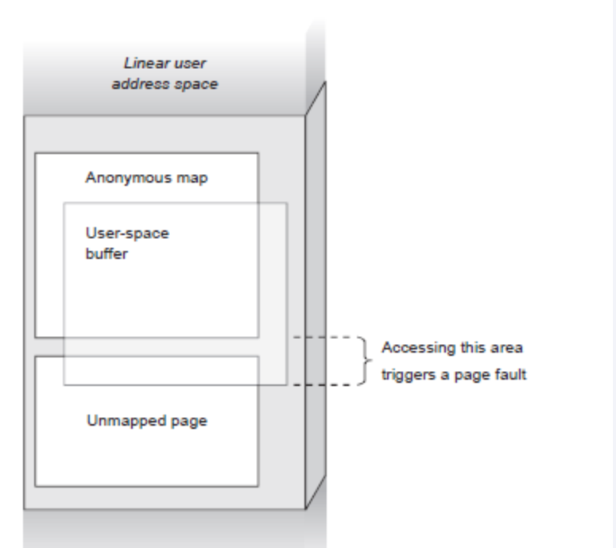
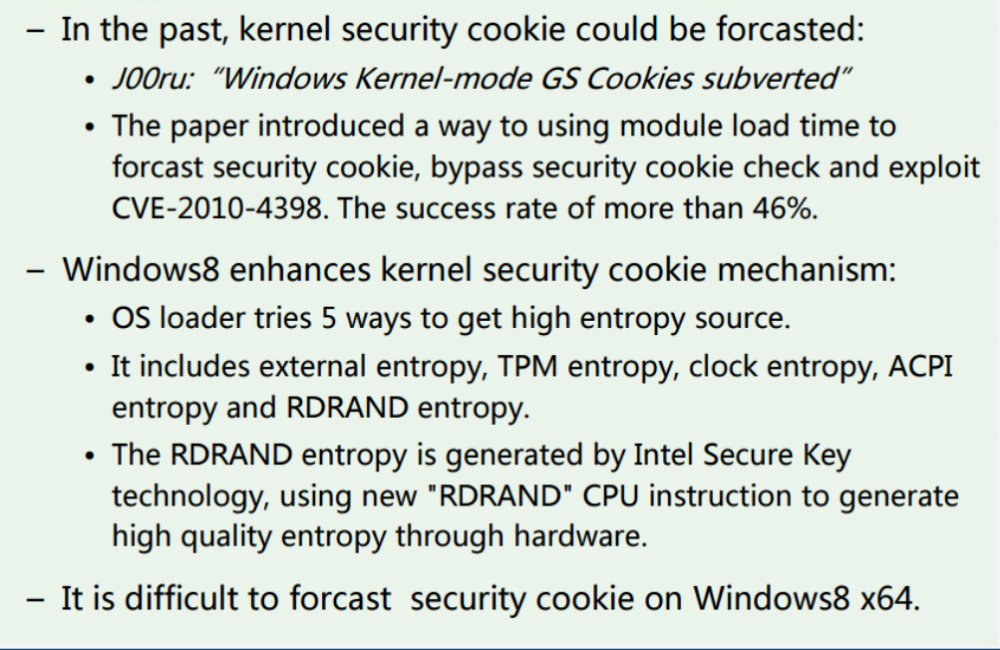
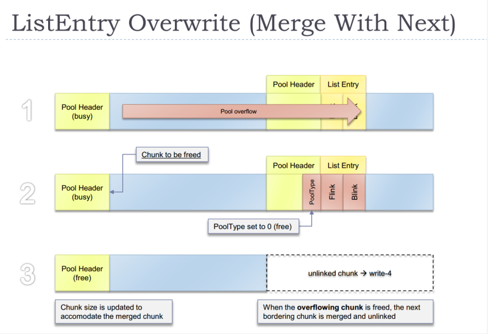
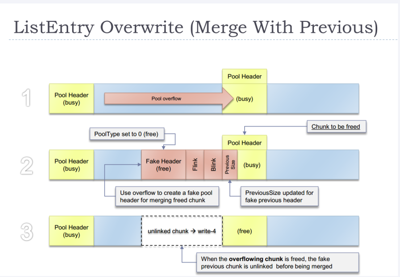
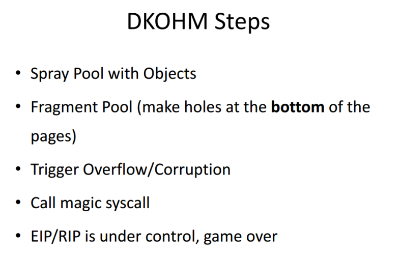
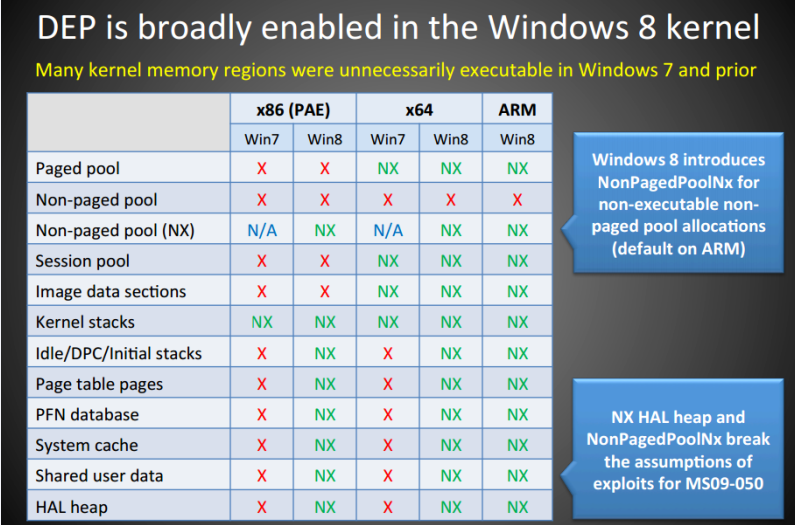

总的来说，内核层和应用层有着诸多相似的地方，但是也有着自己的特点，比如空指针解引用漏洞，SMEP防护机制等。

有趣的是，一些相同原理的防护机制，滞后于对应的应用层比如：Safe Unlink在win7才开始加入到内核防护中，应用层的Safe unlink防护早在WinXP就加入了。

下面按照和应用层相同的思路介绍，分为劫持执行流和执行shellcode两部分。但是要注意的是：
可能不需要执行shellcode，直接提权成功，比如CVE-2014-4113在win8 x64上的利用和CVE-2015-1701的利用

# 获得执行流程

## 1. 栈溢出

### 1.1 最原始利用

大量数据直至覆盖返回地址-->改写EIP，获得执行流

### 1.2 stack cookies

#### 1.2.1 概念

Windows XP SP2引入
类似于应用层的cookie，一个做校验的随机数

#### 1.2.2 绕过方法

和应用层类似，想办法在函数返回之前触发异常
注意try catch不能捕获所有的页异常处理，在内核中引用一块无效地址会导致BSOD，所以这里有一个技巧：

	memcpy的时候就触发异常，不要等到函数返回的时候，或者strcat这种操作的时候

#### 参考：

A Guide to Kernel Exploitation Attacking the Core

#### 预测cookies的值

Win8 x64之前:成功率大于46%。

	J00ru:Windows Kernel-mode GS Cookies subverted

Win8 x64之后:非常困难。

参考：

mj0011,Using a Patched Vulnerability to Bypass Windows 8 x64 Driver Signature Enforcement

## 2. 堆溢出
### 2.1 最原始利用

类似用户层堆，利用堆链表管理的特点，构造Write 4。

### 2.2 Write what

	1.HalDispatchTable+4(常用)
	
	2.修改其为shellcode的地址，然后在用户层调用 NtQueryIntervalProfile(2,X)触发shellcode执行。
	
	3.Token+ PrivilegesOffset.Enabled
	
	4.修改SeDebug权限，之后可以注入代码到系统进程中，完成提权
	Moritz Jodeit，Exploiting CVE-2014-4113 on Windows 8.1
	
	5.LDT
	6.KiDebugRoutine?

### 2.3 Win7 之前

#### 2.3.1 安全机制

似乎没有。。。

#### 2.3.2 绕过方法

主要发生在ListEntry中，在下面几种堆管理的情况下，又可能将溢出变成Write4：

	Unlink in merge with next

	Unlink in merge with previous pool chunk

	Unlink in allocation from ListHeads[n] free list

#### 参考：
	
	SoBeIt X’con 2005
	Kostya Kortchinsky SyScan 2008

### 2.4 Win7

#### 2.4.1 安全机制

	Safe Unlink

类似应用层的Safe Unlink，图示：

#### 2.4.2 绕过方法

	1.ListEntry Flink Overwrite
	2.Lookaside Pointer Overwrite
	3.PoolIndex Overwrite
	4.Quota Process Pointer Overwrite

#### 参考：

	Tarjei Mandt BH DC 2011

### 2.5 Win8

#### 2.5.1 安全机制

都是针对win7上的利用做得改进。

	1.Process quota pointer encoding
	2.Lookaside,delay free,and pool page cookies
	3.PoolIndex bounds check
	4.Additional safe unlinking checks

#### 2.5.2 绕过方法

	1.BlockSize Attack
	2.Split Chunk Attack
	3.DKOHM / Object Type Confusion（重要）

#### 参考：

	Tarjei Mandt BH US 2012
	
	Zhenhua 'Eric' Liu NoSuchCon 2013
	
	Nikita Tarakanov--Exploiting Hardcore Pool Corruptions in Microsoft Windows Kernel NoSuchCon 2013
	
	Nikita Tarakanov--DATA-ONLY PWNING MICROSOFT WINDOWS KERNEL: EXPLOITATION OF KERNEL POOL OVERFLOWS ON MICROSOFT WINDOWS 8.1 ZeroNights 2014

### 2.6 总结

越来越多的pool integrity checks，针对pool metadata/mechanisms的攻击越来越困难，DKOHM是一个趋势。

## 3. 其它
### 3.1 空指针解引用

#### 3.1.1 利用

这算是内核中比较特殊并且数量较大的一类漏洞了，虽然应用层也有空指针解引用漏洞，但是几乎都不能利用。而在Win8之前却是内核漏洞中很流行。

比如CVE-2014-4113、CVE-2015-0003等都是这种漏洞，形式类似：

call [eax+8] // eax=0

具体可以参考这两个漏洞的利用代码，都是公开的。

#### 3.1.2 防护

win8 开始禁止非管理员权限的零页分配

### 3.2 UAF

#### 3.2.1利用

和应用层类似，但是也有自己特殊的地方，比如神奇的WorkerFactoy 对象。

参考：0x710DDDD，CVE-2014-1767_Afd.sys_double-free_漏洞分析与利用

#### 3.2.2防护

	1.Isolated Pools?
	2.Reference count hardening

http://blogs.technet.com/b/srd/archive/2013/11.aspx

### 3.3 竞争条件

这类漏洞一直没能找到相关的PoC，所以并不了解，可以参考：

	http://j00ru.vexillium.org/?p=1695

# 执行shellcode

大多数的漏洞都需要这一步，也有像CVE-2014-4113在win8上面的exp，利用了漏洞本身的特点，不再需要”shellcode“了。

## 1. SMEP/SMAP
### 1.1 概念

	SMEP：处理器cr4寄存器和PTE结合，阻止ring0去执行ring3代码(Prevents supervisor from executing code in user pages)
	
	SMAP：Supervisor Mode Access Prevention，ring0的代码不可以read/write应用层的内存。

### 1.2 绕过方法

思路类似于绕过DEP。

	1.ROP

	ExAllocatePoolWithTag (NonPagedExec) + memcpy+jmp
	
	clear SMEP flag in cr4

参考：
http://blogs.360.cn/blog/hacking-team-part5-atmfd-0day-2/

	2.Leak and Jmp 到一个RWX的内核内存地址(Artem’s Shishkin technique)
	3.Set Owner flag of PTE to 0 (MI_PTE_OWNER_KERNEL)

Win8之前

	通过确定的对象地址，写入一些代码
	但是win8 加入了 non-paged pool NX
	mj0011,Reversing Windows8: Interesting Features of Kernel Security

## 2. Non-paged pool NX

### 2.1 概念

	non-executable non-paged pool

参考

https://msdn.microsoft.com/en-us/library/windows/hardware/hh920391(v=vs.85).aspx

## 3. KASLR
### 3.1 概念

微软在Win8.1之前，对这方面都是很重视，第一次是在Server2008 RTM引入的。

	4 bits of entropy for drivers,5 bits for NTOS/HAL

### 3.2 防护

#### 3.2.1 Win7

	Drivers: 6 bits on x86, 8 bits on x64

#### 3.2.2 Win8

	Biasing of kernel segment base
	
	NTOS/HAL receive 22 bits(64-bit) and 12 bits(32-bit)
	
	Various boot regions also randomized(P0 idle stack)

限制对敏感函数的调用

如果进程运行在低完整性级别以下（保护模式或增强保护模式），那么SystemModuleInformation等相关获得内核模块基址的方法都会被阻止，这样，即使攻击者在保护模式或增强保护模式下触发了内核漏洞，由于无法获得内核基址，也很难进行进一步利用。

参考：
http://blogs.360.cn/blog/fixed_three_0days_in_may/

## 4. DEP

图解：

by：会飞的猫
转载请注明:http://www.cnblogs.com/flycat-2016

