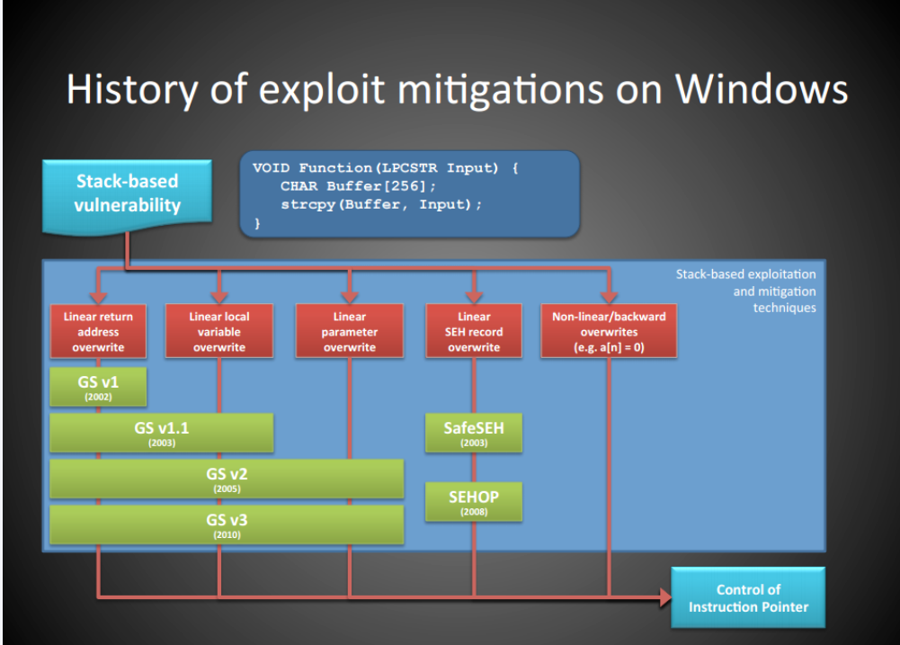
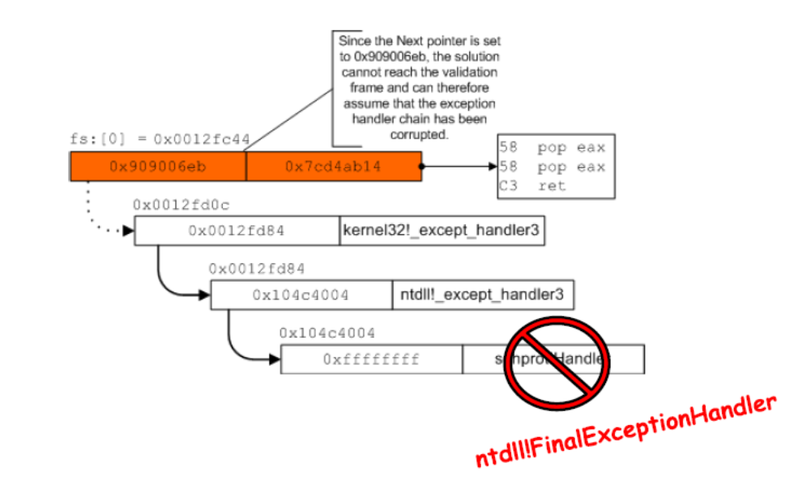
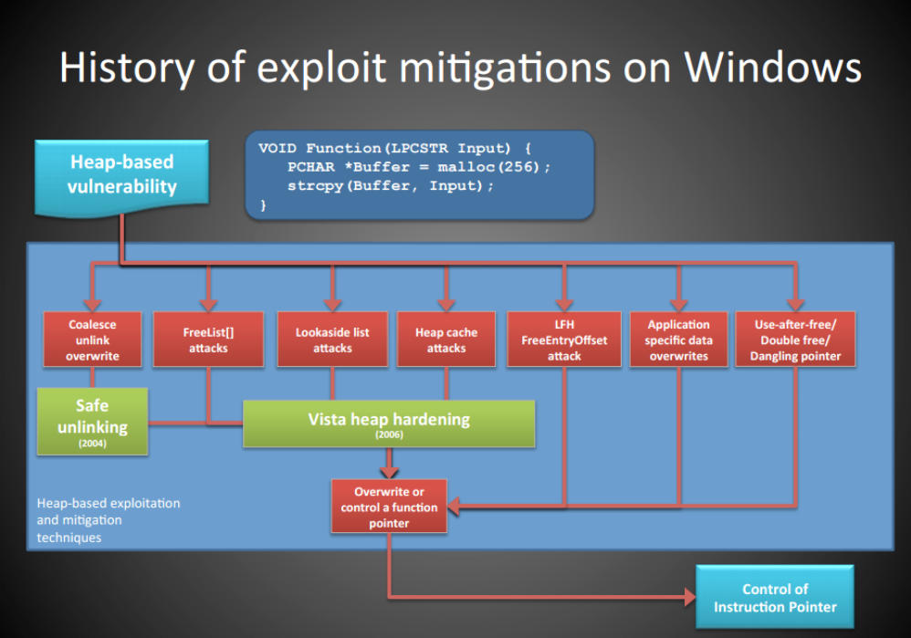
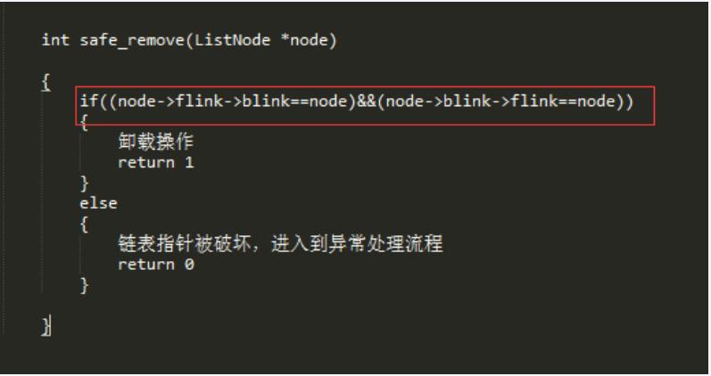
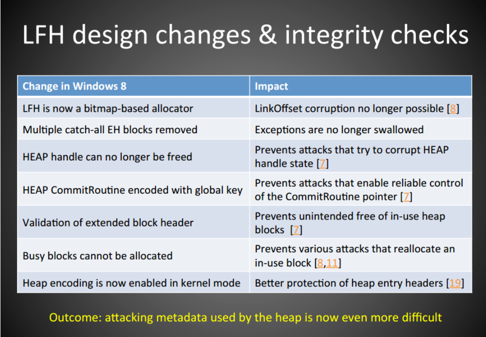
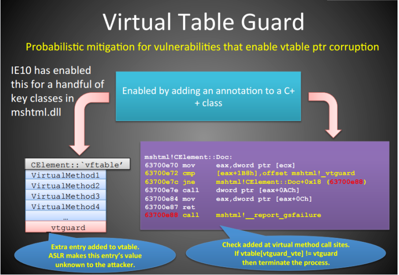
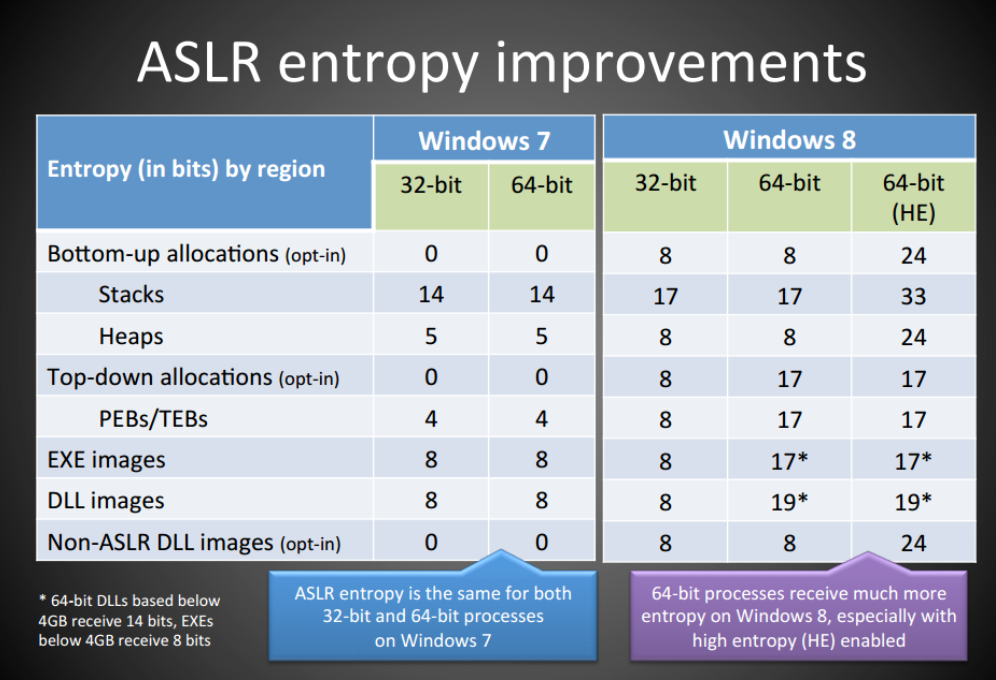
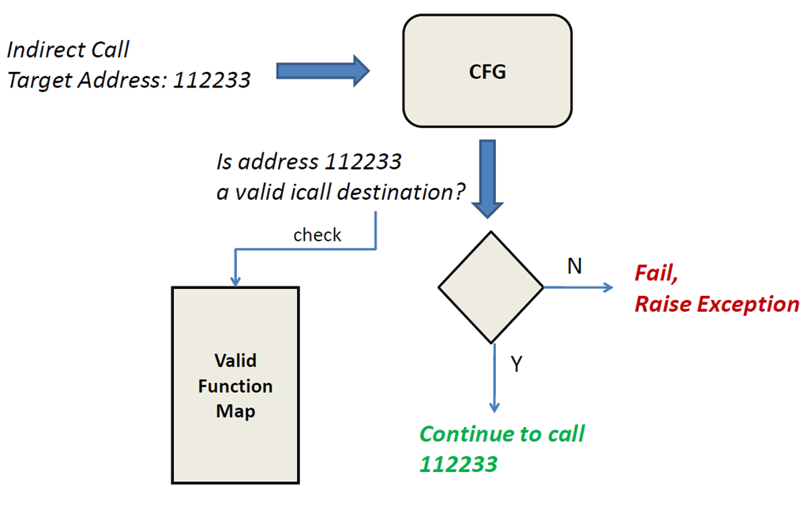

应用层漏洞的目的都是为了执行任意代码，所以分为获得执行流+执行shellcode两部分介绍：

# 获得执行流程

## 1. 栈溢出

### 1.1 总览

发展历史

下图是微软在Black Hat 2012的演讲ppt中的一页

目前状况

a. 非常难以利用:在GS+SEHOP+SEH共同防护下。

b. 在编译器的帮助下，漏洞本身的数量也在减少

### 1.2 最原始的利用

向局部变量填充大量的数据，直至覆盖返回地址，等到函数返回的时候，达到劫持EIP获取执行流目的。

### 1.3 GS

#### 1.3.1. 概念

由Crispin Cowan提出，在编译器(从VS7.0开始)的帮助下,在发生函数调用的时候会向栈中压入一个随机数，函数返回的时候会和在.idata中的值做对比。

#### 1.3.2. GS v1.0

a. 概念

VS 2002 加入

	1.启发式的编译，发现问题函数
	2.Prologue inserts cookie into stack frame
	3.Epilogue checks cookie & terminates on mismatch

b.绕过方法
	
	1.ByPass using Exception Handin

覆盖SEH，在函数返回之前，制造一个异常

	2.Bypass by replacing cookie on stack and in .data section

如果有能力确定cookie存储的位置的话

	3.Bypass because not all buffers are protected(arg_0 for example) --- 有疑问(moonAgirl)

http://www.vupen.com/blog/20100909.Adobe_Acrobat_Reader_0_Day_Exploit_CVE-2010-2883_Technical_Analysis.php

	4.Bypass by overwriting stack data in functions up the stack

比如某个对象或者结构的指针作为当前函数的参数，那么这个值是在当前函数的栈中的，也就是临时变量，这样可以通过直接改写来劫持EIP。

比如覆盖对象的virtuali function call table

	5.Bypass by overwrite ntdll!KiUserExceptionDispatcher.
	6.Bypass because you can guess/calculate the cookie.(haha)
	7.Bypass because the cookie is static.(haha)

#### 1.3.3. GS v1.1

a. 概念

VS2003加入
将可能会发生溢出的local buffer variables紧挨着GS cookies放置，防止溢出后通过覆盖其它变量来劫持EIP。

#### 1.3.4. GS v2.0

a. 概念

VS2005加入

	1.shadow copy of parameters is made
	2.strict GS pragma

b.绕过方法

参考 http://blogs.technet.com/b/srd/archive/2009/03/16/gs-cookie-protection-effectiveness-and-limitations.aspx

#### 1.3.5. GS v3.0

a. 概念

	1.Protect more function
	2.Remove unnecessary checks

参考 http://blogs.technet.com/b/srd/archive/2009/03/20/enhanced-gs-in-visual-studio-2010.aspx

### 1.4 SafeSEH

概念

VS2003加入

编译选项/safeSEH，编译器在编译的时候会建立一个所有已知异常处理函数地址链表，当异常发生的时候会检查这个链表，如果是非法地址，则会立即结束进程。

也称为软件DEP

b.绕过方法

	1.Try not to use SEH based exploit

开启了SEH但是未开启GS的进程。(haha)

	2.攻击没有启用SafeSEH的模块
	3.Point corrupted handler to somewhere other than an image or the stack

因为这种地址不受safeSEH的影响，所以只要在其中找到一条跳转指令就可以了

	4.利用虚函数绕过

### 1.5 SEHOP

a. 概念

检查SEH链的最终异常函数是否为系统固定的函数

b. 绕过方法

	1.攻击虚函数等
	2.利用未启用SEHOP的模块
	3.伪造SEH链表

## 2. 堆溢出
### 2.1 总览

a.发展历史

### 2.2 最原始的利用

a. 利用堆的链表管理特点，操作这个链表的时候就可以构造一个write4

b.Write What?

	内存变量：能够影响程序流程的重要变量，比如虚函数。
	代码逻辑：类似软件破解中的“爆破”，一个字节影响程序的流程。
	函数返回地址：地址不固定较难确定。
	攻击异常处理机制:SEH、VEH、UEF、PEB中的函数指针（程序结束的时候会PEB中的一对指针来调用RtlEnterCriticalSection和RtlLeaveCriticalSection函数）

### 2.3 安全机制

#### 2.3.1 Win XP & Windows Sever 2003

	a.Safe Unlinking

概念

链表项在卸载时候会检查链表的完整性

	b.Heap entry header cookie

概念

一个8位的校验随机数，heap free 的时候进行验证

	c.Pointer encoding

概念

Protect UEF,VEH,and others via EncodeSystemPointer

	绕过方法

1.Unsafe lookaside list allocations
2.Unsafe unlinking of free chunks
3.Unsafe unlink via RtlDeleteCriticalSection
4.Exploiting FreeList[0]

	参考

David Litchfield. Windows Heap Overflows. Black Hat USA. 2004

Alexander Anisimov. Defeating Microsoft Windows XP SP2 Heap protection. 2004

#### 2.3.2 Windows Vista~Windows 7

	a.Removal of commonly targeted data structures

such as lookaside lists and array lists
lookaside replaced by the Low Fragmentation Heap (LFH)

	b.Heap entry metadata randomization

	c.hardening heap cookies

extend checking heap metadata scope,verified in more places,not only when the entry is freed.

	d.Function Pointer encoding

Function pointers (e.g. CommitRoutine) in heap data structures are encoded with a random value

	e.Termination on heap corruption

检测到异常的时候，直接终止程序

	f.Algorithm variation

改进算法，更难预测堆的状态

	g.RtlDeleteCriticalSection technique mitigated by RtlSafeRemoveEntryList

	h.FreeList[0] technique mitigated by RtlpFastRemoveFreeBlock

#### 绕过方法

	1.Corrupting the HEAP data structure
	2.LFH bucket overwrite
	3.LFH FreeEntryOffset corruption and depth desync

#### 参考：
	
	Modern Heap Exploitation using the Low Fragmentation Heap. Chris Valasek.2011
	Attacking the Vista Heap. Ben Hawkes. Nov,2008
	Ghost in the Windows7 Allocator.StevenSeeley,2012

#### 2.3.3 Windows 8

	a.guard pages

	b.allocation order randomization

	c.LFH design changes & integrity checks

## 3. UAF

这里针对的是IE浏览器。

### 3.1 概念

	a.利用可控的假对象替代真对象(内存占位)，劫持程序流程
	
	b.attack class object instead of heap metadata/mechanism

### 3.2 防护

	a. 延迟释放

要释放的内存不会立即释放，而是先并入到一个待释放链表中，大小达到100000的时候才会释放掉。

http://blog.fortinet.com/post/is-use-after-free-exploitation-dead-the-new-ie-memory-protector-will-tell-you

	b. 隔离堆

大多数的DOM对象和相关的类都分配到一个单独的堆中，和通常用来占位的对象比如mshtml string、javascript string等分隔开来，防止占位。

https://labs.mwrinfosecurity.com/blog/isolated-heap-friends-object-allocation-hardening-in-web-browsers/

	c.Virtual Table Guard

类似cookies，在调用虚函数之前会check一下。

	d.Sealed optimization

通过编译器，从源头减少虚函数的间接调用。

### 绕过方法

http://www.k33nteam.org/ms14-056.html
https://www.blackhat.com/docs/us-15/materials/us-15-Gorenc-Abusing-Silent-Mitigations-Understanding-Weaknesses-Within-Internet-Explorers-Isolated-Heap-And-MemoryProtection.pdf

# 执行shellcode

## 1. 总览

## 2. DEP
### 2.1 概念

#### 2.1.1. 软件DEP

其实就是SafeSEH，和NX/XD一点儿关系都木有
一般提到的DEP都是指的硬件DEP

#### 2.1.2. 硬件DEP

需要CPU的支持，通常意义上的DEP，通过修改相关页面的PTE，加入特殊的标识位来达到目的

	a. Windows Xp SP2加入
	
	b. 原理图

	c. 工作状态

	Optin
	
	默认仅为windows系统组件和服务提供，从Vista 开始具有/NXcompat编译选项的程序也会纳入到这个范围内。
	一般用于用户版的操作系统。
	
	Optout
	
	默认为排除列表以外的所有程序和服务启动DEP。
	一般用于服务器操作系统。
	
	AlwaysOn
	
	不存在排除列表这种东西，所有的进程和服务都在内
	只有64位的系统，不可以被关闭
	
	AlwaysOff
	
	对所有进程都禁用
	不能够动态的被开启

其中前面两种情况都是可以动态的关闭的。

	d. 绕过方法

	1.ROP:通过在模块中寻找指令，组成代码段调用函数关闭DEP。
	
	VirtualProtect

	2.改变目标内存地址属性为可执行
	
	Disable DEP for the process(NtSetInformationProcess)

设置进程结构KPROCESS中相关标志位

	VirtualAllocEx
	
	分配一块可执行(RWX)的内存

## 3. ASLR

### 3.1 概念

#### 3.1.1. Windows Vista 引入

#### 3.1.2

目前所有的漏洞利用都有一个共同的特征：需要确定一个固定地址。比如JMP ESP等跳板和ROP所使用指令的地址。所以微软加入了地址随机化来防止获得稳定的地址。

#### 3.1.3.

1.映像随机化
	
	当PE文件映射到内存的时候，系统会对其映射的虚拟地址做随机化处理。
	
	每次系统重启后，地址不同。

可以在注册表中设置

2.堆栈随机化
	
	程序随机化的堆栈基地址。
	
	每次程序重启时都不同。

3.PEB/TEB随机化

### 3.2 绕过方法

#### 3.2.1. 攻击未启动ASLR的模块

#### 3.2.2. Address space spraying(heap/JIT)

	http://www.semantiscope.com/research/BHDC2010/BHDC-2010-Paper.pdf

#### 3.2.3. 预测内存

	http://powerofcommunity.net/poc2010/xiaobo.pdf

#### 3.2.4. 信息泄露

	修改数组对象，越界读
	修改BSTR null结束符
	...

#### 参考：

	https://cansecwest.com/slides/2013/DEP-ASLR%20bypass%20without%20ROP-JIT.pdf
	http://www.semantiscope.com/research/BHDC2010/BHDC-2010-Paper.pdf
	https://www.fireeye.com/blog/threat-research/2013/10/aslr-bypass-apocalypse-in-lately-zero-day-exploits.html
	http://blogs.technet.com/b/srd/archive/2014/03/12/when-aslr-makes-the-difference.aspx

### 3.3 Windows 8

防护机制

	Force ASLR

	进程可以强制non-ASLR images 随机化
	
	Bottom-up & top-down randomization

更难预测内存状态。

随机化的程度提高

去掉了一些可以泄露内存的路径

## 4. CFG
### 4.1 概念

#### 4.1.1

从Win8.1 Update3加入，Win10中正式启用。

#### 4.1.2

代码表示

before

after

#### 4.1.3

图解

### 4.2 绕过方法

绿盟的研究员张云海在BlackHat的议题，思路就是“Overwrite Guard CF Check Function Pointer”，由于该地址只读属性，找到了一个magic object，能够改写该地址属性。

### 参考

	https://www.blackhat.com/docs/us-15/materials/us-15-Zhang-Bypass-Control-Flow-Guard-Comprehensively.pdf
	
	Jack Tang, Trend Micro Threat Solution Team--Exploring Control Flow Guard in Windows 10
	https://blog.coresecurity.com/2015/03/25/exploiting-cve-2015-0311-part-ii-bypassing-control-flow-guard-on-windows-8-1-update-3/
	
	mj0011,Windows 10 Control Flow Guard Internals

到此，应用层的漏洞利于与防护介绍完了

by：会飞的猫
转载请注明:http://www.cnblogs.com/flycat-2016

